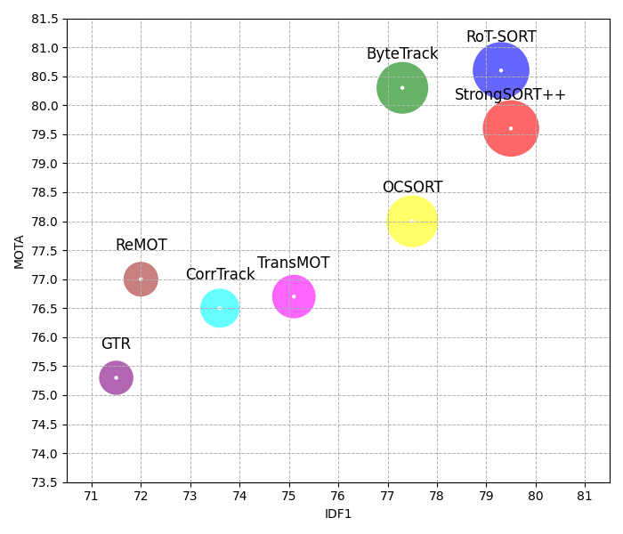

> [**Adaptive and Extended Trajectory Matching for Robust Multi-Target Tracking**](https://arxiv.org/abs/2206.14651)
> 
> Shengbo Wang 


<p align="center"></p>

## Highlights 🚀

- YOLOX support
- Multi-class support
- Camera motion compensation
- Re-identification

## Coming Soon
- [x] Multi-class support.
- [x] Create OpenCV VideoStab GMC python binding or <u>write Python version<u>.
- [ ] Deployment code.

## Abstract

The goal of multi-object tracking (MOT) is detecting and tracking all the objects in a scene, while keeping a unique identifier for each object.


### Visualization results on MOT challenge test set

[](https://www.youtube.com/watch?v=MLiNnFCLwY0)


[](https://www.youtube.com/watch?v=O8KNGNFj3FI)


## Tracking performance
### Results on MOT17 challenge test set
| Tracker  |  MOTA | IDF1 | HOTA |
|:---------|:-------:|:----:|:----:|
| RoT-SORT |  80.6   | 79.3 | 64.7 |


### Results on MOT20 challenge test set
| Tracker  | MOTA   | IDF1 | HOTA |
|:---------|:-------:|:----:|:----:|
| RoT-SORT | 77.7   | 76.7 | 62.8 |  


## Installation

The code was tested on Ubuntu 20.04

RoT-SORT code is based on ByteTrack and FastReID. <br>

 
### Setup with Anaconda
**Step 1.** Create Conda environment and install pytorch.
```shell
conda create -n Rotsort python=3.7
conda activate Rotsort
```
**Step 2.** Install torch and matched torchvision from [pytorch.org](https://pytorch.org/get-started/locally/).<br>
The code was tested using torch 1.11.0+cu113 and torchvision==0.12.0 

**Step 3.** Install RoT-SORT.
```shell
git clone https://github.com/NirAharon/BoT-SORT.git
cd RoT-SORT
pip3 install -r requirements.txt
python3 setup.py develop
```


## Data Preparation

Download [MOT17](https://motchallenge.net/data/MOT17/) and [MOT20](https://motchallenge.net/data/MOT20/) from the [official website](https://motchallenge.net/). And put them in the following structure:

```
<dataets_dir>
      │
      ├── MOT17
      │      ├── train
      │      └── test    
      │
      └── MOT20
             ├── train
             └── test
```

For training the ReID, detection patches must be generated as follows:   

```shell
cd <RoT-SORT_dir>

# For MOT17 
python3 fast_reid/datasets/generate_mot_patches.py --data_path <dataets_dir> --mot 17

# For MOT20
 python3 fast_reid/datasets/generate_mot_patches.py --data_path <dataets_dir> --mot 20
```
Link dataset to FastReID ```export FASTREID_DATASETS=<BoT-SORT_dir>/fast_reid/datasets```. If left unset, the default is `fast_reid/datasets` 
 
## Model Zoo
Download and store the trained models in 'pretrained' folder as follow:
```
<RoT-SORT_dir>/pretrained
```
- We used the publicly available [ByteTrack](https://github.com/ifzhang/ByteTrack) model zoo trained on MOT17, MOT20 and ablation study for YOLOX object detection.

- Ours trained ReID models can be downloaded from [MOT17-SBS-S50](https://drive.google.com/file/d/1QZFWpoa80rqo7O-HXmlss8J8CnS7IUsN/view?usp=sharing), [MOT20-SBS-S50](https://drive.google.com/file/d/1KqPQyj6MFyftliBHEIER7m_OrGpcrJwi/view?usp=sharing).

- For multi-class MOT use [YOLOX](https://github.com/Megvii-BaseDetection/YOLOX) or [YOLOv7](https://github.com/WongKinYiu/yolov7) trained on COCO (or any custom weights). 

## Training

[//]: # (### Training the Detector)

[//]: # ()
[//]: # (Please refer to [ByteTrack]&#40;https://github.com/ifzhang/ByteTrack&#41; for training detector.)

### Train the ReID Module

After generating MOT ReID dataset as described in the 'Data Preparation' section.

```shell
cd <RoT-SORT_dir>

# For training MOT17 
python3 fast_reid/tools/train_net.py --config-file ./fast_reid/configs/MOT17/sbs_S50.yml MODEL.DEVICE "cuda:0"

# For training MOT20
python3 fast_reid/tools/train_net.py --config-file ./fast_reid/configs/MOT20/sbs_S50.yml MODEL.DEVICE "cuda:0"
```

Refer to [FastReID](https://github.com/JDAI-CV/fast-reid)  repository for addition explanations and options.

## Tracking

By submitting the txt files produced in this part to [MOTChallenge](https://motchallenge.net/) website and you can get the same results as in the paper.<br>
Tuning the tracking parameters carefully could lead to higher performance. In the paper we apply ByteTrack's calibration.

* **Test on MOT17**

```shell
cd <RoT-SORT_dir>
python3 tools/track.py <dataets_dir/MOT17> --default-parameters --with-reid --benchmark "MOT17" --eval "test" 
python3 tools/interpolation.py --txt_path <path_to_track_result>
```

* **Test on MOT20**

```shell
cd <RoT-SORT_dir>
python3 tools/track.py <dataets_dir/MOT20> --default-parameters --with-reid --benchmark "MOT20" --eval "test" 
python3 tools/interpolation.py --txt_path <path_to_track_result>
```

```shell
cd <RoT-SORT_dir>

# BoT-SORT
python3 tools/track.py <dataets_dir/MOT17> --default-parameters --benchmark "MOT17" --eval "val" --fp16 --fuse

# BoT-SORT-ReID
python3 tools/track.py <dataets_dir/MOT17> --default-parameters --with-reid --benchmark "MOT17" --eval "val" --fp16 --fuse
```

* **Other experiments**

Other parameters can be used __without__ passing --default-parameters flag. <br>
For evaluating the train and validation sets we recommend using the official MOTChallenge evaluation code from [TrackEval](https://github.com/JonathonLuiten/TrackEval). 

```shell
# For all the available tracking parameters, see:
python3 tools/track.py -h 
```


## Demo

Demo with RoT-SORT based YOLOX .

```shell
cd <RoT-SORT_dir>

# Original example
python3 tools/demo.py video --path <path_to_video> -f yolox/exps/example/mot/yolox_x_mix_det.py -c pretrained/bytetrack_x_mot17.pth.tar --with-reid --fuse-score --fp16 --fuse --save_result

# Multi-class example
python3 tools/mc_demo.py video --path <path_to_video> -f yolox/exps/example/mot/yolox_x_mix_det.py -c pretrained/bytetrack_x_mot17.pth.tar --with-reid --fuse-score --fp16 --fuse --save_result
```

## Acknowledgement

A large part of the codes, ideas and results are borrowed from 
[ByteTrack](https://github.com/ifzhang/ByteTrack), 
[StrongSORT](https://github.com/dyhBUPT/StrongSORT),
[FastReID](https://github.com/JDAI-CV/fast-reid),
[YOLOX](https://github.com/Megvii-BaseDetection/YOLOX)
Thanks for their excellent work!


